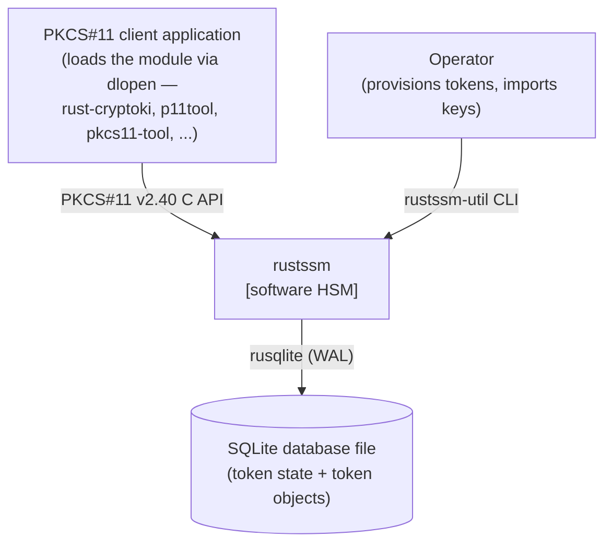
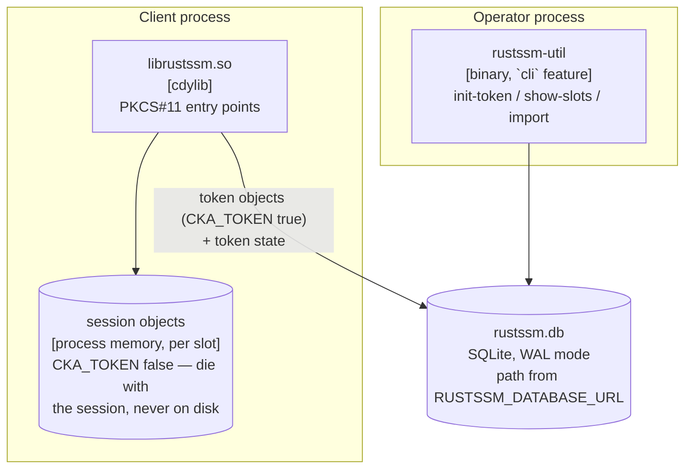
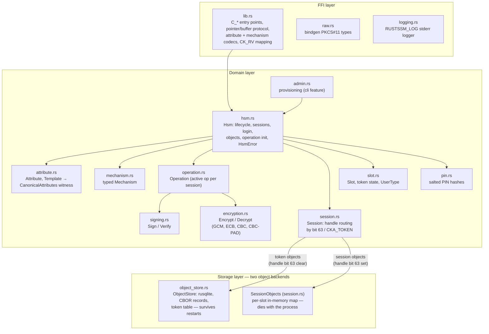

# Architecture

rustssm is a software HSM: a Rust `cdylib` (`librustssm.so`) that PKCS#11
clients load directly, in the spirit of SoftHSM. This document describes the
architecture following the [C4 model](https://c4model.com) — context,
containers, components — followed by the design decisions that shape the
code. For what is and is not implemented, see [README.md](README.md); for the
roadmap, [TODO.md](TODO.md).

## Level 1 — System context

rustssm sits between a PKCS#11 client application and a SQLite database file
that holds all persistent token state. The library runs inside the client's process, and an operator provisions tokens
with a bundled CLI against the same database file.

## Level 2 — Containers

Two build artifacts share one crate (`crate-type = ["cdylib", "rlib"]`) and
one store:

- **`librustssm.so`** — the module a client loads. All state lives in one
  process-global `static HSM: LazyLock<Hsm>`; there is no global lock around
  the FFI, so threads run concurrent `C_*` calls and contend only on inner
  locks.
- **`rustssm-util`** — a `softhsm2-util` analogue. It links the same crate as
  an rlib and drives the same `Hsm` domain paths (`init_token`, `init_pin`,
  `import`), not a side channel. Gated behind the `cli` feature so the cdylib
  never contains cli-related dependencies.
- **The SQLite file** is the only shared state between processes. WAL mode
  plus SQLite's own locking make concurrent multi-process access safe; the
  `RUSTSSM_DATABASE_URL` variable is deliberately namespaced so it cannot
  clash with a host application's own `DATABASE_URL`. Session objects
  deliberately never reach it: they stay in the creating process's memory, so
  processes sharing a store cannot interfere with each other's session keys.

## Level 3 — Components

Inside the library, modules form three layers with strict boundaries: an FFI
translation layer, a domain layer, and storage. Raw PKCS#11 codes
(`CKA_*`/`CKM_*`/`CKR_*`) and pointers exist **only** in the FFI layer; the
domain deals exclusively in typed values.

A typical call (`C_GenerateKey`) flows top to bottom: `lib.rs` parses the
session handle, mechanism struct, and attribute template into typed values
and calls `Hsm::generate_key`; the domain validates the template, runs the
key generation, and hands the result to the `Session`, which routes it to the
store or the in-memory session-object map; every error travels back as an
`HsmError` that `lib.rs` maps onto a `CK_RV` in exactly one place.

## Design decisions

### Crash-only error policy

Expected failures return `CK_RV` codes through `Result` values. Panics mean a
broken internal invariant and deliberately **abort the host process** — there
is no `catch_unwind`. Corollary: code must never feed a panicking API an
input that client data can make invalid (e.g. the unpadded block modes
pre-check alignment because the padding API panics on unaligned input).

### FFI / domain boundary

`lib.rs` owns everything C-shaped: pointer dereferencing, the PKCS#11
output-buffer protocol (null buffer = length query, `CKR_BUFFER_TOO_SMALL`
without consuming the operation), attribute byte encodings, and the
`HsmError → CK_RV` table. The domain layer is a safe, testable Rust API — the
unit suite drives it directly without any FFI.

### Parse, don't validate: witness types

Object creation is guarded by construction rather than by discipline:

- `Template::new` rejects unsupported and duplicate attributes; a `Template`
  is proof of validation.
- `Template::merge` folds in token-derived attributes and class defaults and
  is the **only** producer of `CanonicalAttributes` — the only list a
  `Session` will persist. A creation path that skips validation or the merge
  does not compile.
- `SessionContext` snapshots the login state in a single slot-map walk;
  private-object visibility (PKCS#11 §4.4) is enforced where the object is
  read, not ad hoc per call.

### Two object stores, one handle space

Token objects (`CKA_TOKEN` true) persist in SQLite; session objects live in a
per-slot in-memory map shared by that slot's sessions (SoftHSM semantics:
destroyed when the creating session closes, dead with the process, never on
disk). Handles are partitioned by bit 63: SQLite `AUTOINCREMENT` rowids are
positive `i64` (bit 63 always clear), session handles set bit 63 plus a
per-process counter — collisions are impossible by construction, and a
compile-time assert pins the 64-bit handle width. `Session` routes every
read/write/copy/delete on that bit (or on `CKA_TOKEN` at creation);
`C_CopyObject` is the one way an object crosses the boundary.

### Persistence format

An object row is a version byte plus one self-describing CBOR document
(attributes stored by variant name plus the key material as an embedded
typed value). Name-based encoding tolerates schema evolution; an unknown
version byte fails loudly (`UnsupportedFormat`) rather than being misread.
Token state (label, salted-SHA-256 PIN hashes) lives in a `token` table in
the same file. Multi-row invariants use transactions (`write_pair` for key
pairs), which together with WAL is what the crash-only policy leans on.

### Locking

There is no global lock: every `C_*` call runs concurrently and takes only
the locks it needs. Those locks form a fixed hierarchy, from coarse to fine:

1. one slot (`RwLock<Slot>`) — token state, login, and the slot's session
   map (opening/closing a session takes the write lock, lookups the read
   lock);
2. one session (`RwLock<Session>`) — the active operation, search state;
3. the **leaves**: the store's connection `Mutex` and the slot's
   session-object map. Leaf locks are only ever taken last, with nothing
   taken after them.

(The slot map itself — `Hsm.slots` — is fixed at construction and never
mutated, so it needs no lock at all; only slot *contents* change. Similarly,
`Hsm.object_store` is a `OnceLock` only to defer the fallible database open
to `C_Initialize` — after that it is a plain atomic load, not a contended
lock.)

Two rules keep this deadlock-free:

- **Take locks in hierarchy order, never backwards.** Deadlock requires a
  cycle — thread A holds lock X and wants Y while thread B holds Y and wants
  X. If every thread acquires locks only downward through the same total
  order, no cycle can form. So code that has a session guard must not reach
  back up to a slot; anything it needs from higher levels is captured
  *before* descending.
- **Never take the same lock twice in one call, even for reading.**
  `std::sync::RwLock` is not reentrant: if a thread holding a read guard
  takes a second read of the same lock, and a writer queued up in between,
  the second read blocks behind the writer while the writer blocks behind
  the first guard — deadlock, with no second thread required.

The second rule is the easy one to break by accident, because it hides
inside call chains: a helper that "just reads the session" deadlocks when
called from a context that already holds that session's guard. This is the
main reason `SessionContext` exists. It walks the hierarchy once, capturing
what the call needs from the upper levels (the session `Arc` and a snapshot
of the login state), and its methods that lock internally (`object`,
`check_writable`) are documented to be called *before* taking the session
guard — entry points do their context work first and take the guard as the
final step, so the "same lock twice" situation cannot arise.

Thread safety overall is by construction — `Hsm: Sync`, all shared state
behind these locks or atomics — and exercised by a stress test that hammers
one `Hsm` from many threads through full keygen/sign/encrypt/search/destroy
cycles.

## Testing

Four rings, ordered by feedback speed:

1. **Unit** (`src/hsm_tests.rs`) — the domain API against an in-memory
   store; includes known-answer vectors and a concurrency stress test.
2. **FFI integration** (`tests/pkcs11.rs`) — dlopens the built cdylib via
   `libloading` and drives the full lifecycle through `C_GetFunctionList`,
   covering pointer parsing and the buffer protocol.
3. **rust-cryptoki suite** (external) — broad mechanism coverage against the
   real `.so`; the pass/fail baseline is tracked in [TODO.md](TODO.md).
4. **Consumer integration** — client applications' own HSM test suites run
   against a provisioned scratch store.
